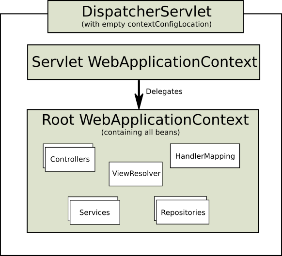

# 21.2 DispatcherServlet

> Spring’s web MVC framework is, like many other web MVC frameworks, request-driven, designed around a central Servlet that dispatches requests to controllers and offers other functionality that facilitates the development of web applications. Spring’s `DispatcherServlet` however, does more than just that. It is completely integrated with the Spring IoC container and as such allows you to use every other feature that Spring has.

与其他很多web的MVC框架一样，Spring Web MVC框架是由请求驱动的。所有设计都围绕着一个中央Servlet来展开，它负责把所有请求分发到控制器，同时提供了很多web应用开发所需要的功能。不过，Spring的`DispatcherServlet`能做的比这更多，它与Spring IoC容器做了无缝的集成，这意味着，任何Spring具有的特性你都可以在Spring MVC中使用。

> The request processing workflow of the Spring Web MVC `DispatcherServlet` is illustrated in the following diagram. The pattern-savvy reader will recognize that the `DispatcherServlet` is an expression of the "Front Controller" design pattern (this is a pattern that Spring Web MVC shares with many other leading web frameworks).

下面这张图展示了Spring Web MVC的`DispatcherServlet`处理请求的工作流。熟悉设计模式的朋友会发现，`DispatcherServlet`应用的其实就是一个“前端控制器”的设计模式（其实很多其他优秀的web框架也都使用了这个设计模式）。


> The DispatcherServlet is an actual Servlet (it inherits from the HttpServlet base class), and as such is declared in the web.xml of your web application. You need to map requests that you want the DispatcherServlet to handle, by using a URL mapping in the same web.xml file. This is standard Java EE Servlet configuration; the following example shows such a DispatcherServlet declaration and mapping:

`DispatcherServlet`其实就是个`Servlet`（它继承自`HttpServlet`基类），它也是在你的web应用的`web.xml`配置文件下声明的。同样，你需要在`web.xml`文件中把你希望`DispatcherServlet`处理的请求映射到对应的URL上去。这就是标准的Java EE Servlet配置；下面的代码就展示了对`DispatcherServlet`和映射路径的声明。

```xml
<web-app>
    <servlet>
        <servlet-name>example</servlet-name>
        <servlet-class>org.springframework.web.servlet.DispatcherServlet</servlet-class>
        <load-on-startup>1</load-on-startup>
    </servlet>

    <servlet-mapping>
        <servlet-name>example</servlet-name>
        <url-pattern>/example/*</url-pattern>
    </servlet-mapping>
</web-app>
```

> In the preceding example, all requests starting with `/example` will be handled by the `DispatcherServlet` instance named example. In a Servlet 3.0+ environment, you also have the option of configuring the Servlet container programmatically. Below is the code based equivalent of the above web.xml example:

在上面的例子中，所有以`/example`开头的请求都会被`DispatcherServlet`处理，并且该`DispatcherServlet`实例的名字为`example`。在Servlet 3.0+的环境下，你还可以用代码来配置Servlet容器。下面这段代码就展示了这种用法，它与我们所写的`web.xml`配置文件是等效的。

```java
public class MyWebApplicationInitializer implements WebApplicationInitializer {

    @Override
    public void onStartup(ServletContext container) {
        ServletRegistration.Dynamic registration = container.addServlet("dispatcher", new DispatcherServlet());
        registration.setLoadOnStartup(1);
        registration.addMapping("/example/*");
    }

}
```

> WebApplicationInitializer is an interface provided by Spring MVC that ensures your code-based configuration is detected and automatically used to initialize any Servlet 3 container. An abstract base class implementation of this interface named AbstractDispatcherServletInitializer makes it even easier to register the DispatcherServlet by simply specifying its servlet mapping. See Code-based Servlet container initialization for more details.

`WebApplicationInitializer`是Spring MVC提供的接口，它会查找你通过编程方式进行配置的代码，并应用它们来初始化Servlet 3版本以上的web容器。它有一个抽象的实现`AbstractDispatcherServletInitializer`，它简化了`DispatcherServlet`的注册工作，你只需要指定servlet的映射（mapping）即可。如果想要了解更多的细节，可以参考其他基于代码配置的servlet容器。

> The above is only the first step in setting up Spring Web MVC. You now need to configure the various beans used by the Spring Web MVC framework (over and above the DispatcherServlet itself).

上面只是配置Spring Web MVC的第一步，你还需要配置其他的一些bean，它们也会被Spring Web MVC框架使用到（除了`DispatcherServlet`以外的其他bean）。

> As detailed in Section 6.15, “Additional Capabilities of the ApplicationContext”, ApplicationContext instances in Spring can be scoped. In the Web MVC framework, each DispatcherServlet has its own WebApplicationContext, which inherits all the beans already defined in the root WebApplicationContext. These inherited beans can be overridden in the servlet-specific scope, and you can define new scope-specific beans local to a given Servlet instance.

6.15节“Additional Capabilities of the ApplicationContext(ApplicationContext的其他作用)”中我们聊到，`ApplicationContext`实例是可以有范围（scope）的。在Web MVC框架中，每个`DispatcherServlet`都持有一个自己的上下文对象`WebApplicationContext`，它又继承了根`WebApplicationContext`对象中已经定义的所有bean。这些继承的bean可以在每个servlet的特定scope内被重载，在每个Servlet实例中你也可以定义其scope内新的bean。（这句翻译得渣渣我知道……）


> Upon initialization of a DispatcherServlet, Spring MVC looks for a file named [servlet-name]-servlet.xml in the WEB-INF directory of your web application and creates the beans defined there, overriding the definitions of any beans defined with the same name in the global scope.

在`DispatcherServlet`的初始化过程中，框架会在你web应用的WEB-INF目录下查找一个名为[servlet-name]-servlet.xml的配置文件，创建其中所定义的bean。如果在全局作用域(global scope)中存在相同名字的bean，则它们将被新的bean定义覆盖。

> Consider the following DispatcherServlet Servlet configuration (in the web.xml file):

请看下面这个`DispatcherServlet`的配置（定义于web.xml文件中）：

```xml
<web-app>
    <servlet>
        <servlet-name>golfing</servlet-name>
        <servlet-class>org.springframework.web.servlet.DispatcherServlet</servlet-class>
        <load-on-startup>1</load-on-startup>
    </servlet>
    <servlet-mapping>
        <servlet-name>golfing</servlet-name>
        <url-pattern>/golfing/*</url-pattern>
    </servlet-mapping>
</web-app>
```

> With the above Servlet configuration in place, you will need to have a file called /WEB-INF/golfing-servlet.xml in your application; this file will contain all of your Spring Web MVC-specific components (beans). You can change the exact location of this configuration file through a Servlet initialization parameter (see below for details).

假设我们有一个如上定义的配置文件，那么我们还需要在应用中的`/WEB-INF/`路径下配置一个`golfing-servlet.xml`文件，该文件必须包含所有Spring Web MVC相关的组件的定义（比如bean等）。你也可以改变这个配置文件所在的目录，这需要在一个servlet初始化参数中指定（见下面的例子）：

> It is also possible to have just one root context for single DispatcherServlet scenarios.

当你的应用中只需要一个`DispatcherServlet`时，只配置一个根context对象也是可行的。



> This can be configured by setting an empty contextConfigLocation servlet init parameter, as shown below:

若要配置一个唯一的根context对象，可以通过在servlet的初始化参数中配置一个空的contextConfigLocation来做到，如下所示：

```xml
<web-app>
    <context-param>
        <param-name>contextConfigLocation</param-name>
        <param-value>/WEB-INF/root-context.xml</param-value>
    </context-param>
    <servlet>
        <servlet-name>dispatcher</servlet-name>
        <servlet-class>org.springframework.web.servlet.DispatcherServlet</servlet-class>
        <init-param>
            <param-name>contextConfigLocation</param-name>
            <param-value></param-value>
        </init-param>
        <load-on-startup>1</load-on-startup>
    </servlet>
    <servlet-mapping>
        <servlet-name>dispatcher</servlet-name>
        <url-pattern>/*</url-pattern>
    </servlet-mapping>
    <listener>
        <listener-class>org.springframework.web.context.ContextLoaderListener</listener-class>
    </listener>
</web-app>
```

> The WebApplicationContext is an extension of the plain ApplicationContext that has some extra features necessary for web applications. It differs from a normal ApplicationContext in that it is capable of resolving themes (see Section 21.9, “Using themes”), and that it knows which Servlet it is associated with (by having a link to the ServletContext). The WebApplicationContext is bound in the ServletContext, and by using static methods on the RequestContextUtils class you can always look up the WebApplicationContext if you need access to it.

`WebApplicationContext`继承自`ApplicationContext`，包含了一些web应用经常需要用到的特性。它与普通的`ApplicationContext`不同的地方在于，它支持主题（theme）的解析（见21.9节“主题（theme）的使用”），并且它与持有它的servlet关联在一起（通过持有一个`ServletContext`的引用来实现）。`WebApplicationContext`与`ServletContext`是绑定的，如果需要的话，你可以通过`RequestContextUtils`工具类中的静态方法来拿到这个web应用的上下文`WebApplicationContext`。

